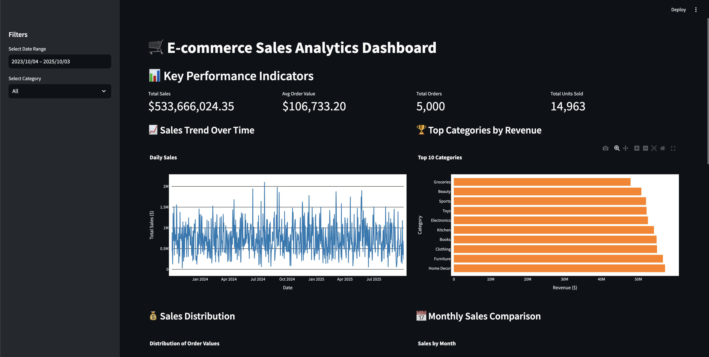
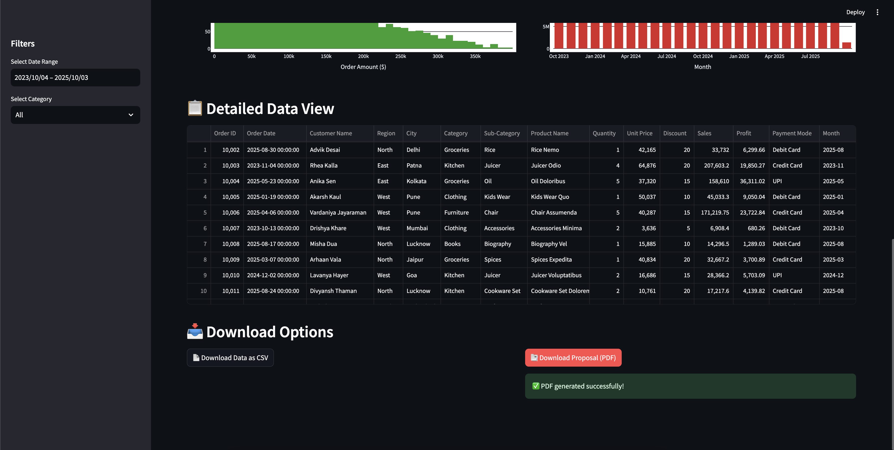
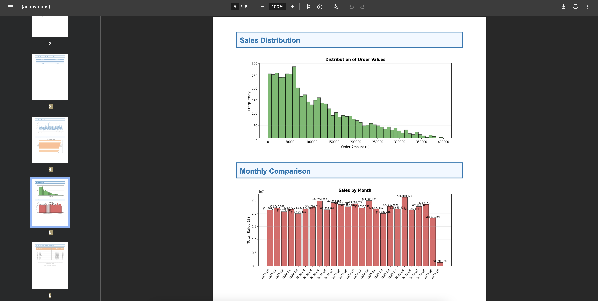

# 🛒 E-commerce Sales Dashboard

An interactive analytics dashboard built with Streamlit for visualizing and analyzing e-commerce sales data.


### Interactive Dashboard





## 📋 Features

- **Real-time Filtering**: Filter data by date range and product categories
- **Key Performance Indicators**: 
  - Total Sales Revenue
  - Average Order Value
  - Total Orders
  - Total Units Sold
- **Interactive Visualizations**:
  - Sales trend analysis over time
  - Top performing categories
  - Order value distribution
  - Monthly sales comparison
- **Data Export**: Download filtered data as CSV
- **Responsive Design**: Optimized layout for data exploration

## 🚀 Getting Started

### Prerequisites

- Python 3.8 or higher
- pip package manager
- Kaggle account (for dataset download)

### Installation

1. **Clone or download this repository**

```bash
git clone <your-repo-url>
cd ecommerce-dashboard
```

2. **Install required packages**

```bash
pip install -r requirements.txt
```

Or install manually:

```bash
pip install streamlit pandas plotly numpy kaggle
```

3. **Set up Kaggle API credentials**

   - Go to [Kaggle Account Settings](https://www.kaggle.com/settings)
   - Scroll to the "API" section
   - Click "Create New API Token"
   - Save the downloaded `kaggle.json` file to:
     - **Linux/Mac**: `~/.kaggle/kaggle.json`
     - **Windows**: `C:\Users\<Username>\.kaggle\kaggle.json`
   - Set permissions (Linux/Mac only):
     ```bash
     chmod 600 ~/.kaggle/kaggle.json
     ```

4. **Download the dataset**

```bash
kaggle datasets download -d prince7489/e-commerce-sales
unzip e-commerce-sales.zip
```

5. **Verify the CSV file**

Make sure `Ecommerce_Sales_Data_2024_2025.csv` is in the same directory as `ecommerce-dashboard.py`, or update the file path in the code.

## 💻 Usage

### Running the Dashboard

```bash
streamlit run ecommerce-dash-pdf.py
```

The dashboard will open automatically in your default web browser at `http://localhost:8501`

### Using the Dashboard

1. **Sidebar Filters**:
   - Select a date range to filter the data
   - Choose specific categories or view all

2. **KPI Cards**: View key metrics at the top of the dashboard

3. **Visualizations**: Interact with charts by:
   - Hovering over data points for details
   - Zooming and panning
   - Using the toolbar in the top-right of each chart

4. **Data Table**: Browse raw data at the bottom

5. **Export Data**: Click the download button to export filtered data

## 📁 Project Structure

```
ecommerce-dashboard/
│
├── ecommerce-dashboard.py          # Main Streamlit application
├── Ecommerce_Sales_Data_2024_2025.csv          # E-commerce sales dataset
├── requirements.txt     # Python dependencies
└── README.md           # This file
```

## 🔧 Configuration

### Customizing Column Names

The dashboard automatically detects common column names. If your dataset uses different names, update these mappings in `ecommerce-dashboard.py`:

```python
# Date columns: 'Date', 'Order Date'
# Amount columns: 'Amount', 'Sales', 'Total', 'Revenue', 'Price'
# Category columns: 'Category', 'Product Category', 'Item Category'
# Quantity columns: 'Quantity', 'Qty', 'Units'
```

## 📊 Dataset Information

**Source**: [Kaggle - E-commerce Sales Dataset](https://www.kaggle.com/datasets/prince7489/e-commerce-sales)

The dataset typically contains information about:
- Order dates
- Product categories
- Sales amounts
- Quantities sold
- Customer information
- Geographic data

## 🛠️ Requirements

Create a `requirements.txt` file with:

```
streamlit>=1.28.0
pandas>=2.0.0
plotly>=5.17.0
numpy>=1.24.0
```

## 🤝 Contributing

Contributions are welcome! Feel free to:
- Report bugs
- Suggest new features
- Submit pull requests

## 📝 License

This project is open source and available under the MIT License.

## 🐛 Troubleshooting

### Common Issues

**Issue**: `FileNotFoundError: Ecommerce_Sales_Data_2024_2025.csv not found`
- **Solution**: Ensure the CSV file is in the correct directory or update the file path

**Issue**: `ModuleNotFoundError`
- **Solution**: Install missing packages using `pip install <package-name>`

**Issue**: Kaggle API authentication error
- **Solution**: Verify `kaggle.json` is in the correct location with proper permissions

**Issue**: Charts not displaying
- **Solution**: Ensure all required columns exist in your dataset

## 📧 Contact

For questions or support, please open an issue in the repository.

## 🙏 Acknowledgments

- Dataset provided by [Prince7489](https://www.kaggle.com/prince7489) on Kaggle
- Built with [Streamlit](https://streamlit.io/)
- Visualizations powered by [Plotly](https://plotly.com/)

---

**Happy Analyzing! 📈**